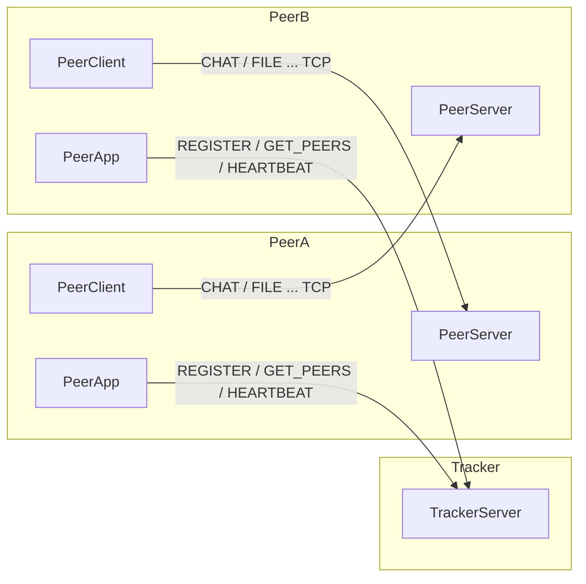

# BÁO CÁO ĐỒ ÁN — CHỦ ĐỀ 3  
## Hệ thống chat ngang hàng P2P (Peer-to-Peer Chat System)

> **Gợi ý sử dụng:** Copy nội dung vào Word/Google Docs; thay `[Tên nhóm]`, `[Thành viên]`, `[Ngày]`; bổ sung ảnh chụp màn hình demo vào mục 5; chỉnh lại nếu thầy có mẫu báo cáo riêng.

---

## Thông tin chung

| Mục | Nội dung |
|-----|----------|
| Môn / Chủ đề | Hệ thống phân tán — Chủ đề 3 |
| Tên đề tài | Phát triển hệ thống chat P2P |
| Nhóm / SV thực hiện | [Điền] |
| Repository mã nguồn | https://github.com/ThaiHuuKhoi/Chat_System_P2P |
| Công nghệ | Java 24, Maven, TCP Socket, Gson (JSON), AES |

---

## 1. Giới thiệu

### 1.1. Mục tiêu

Xây dựng hệ thống chat **ngang hàng (P2P)**: nhiều người dùng trao đổi tin **trực tiếp qua mạng**, **không phụ thuộc hoàn toàn** vào một server trung tâm xử lý tin nhắn. Server trung tâm trong đồ án chỉ đóng vai trò **bootstrap/tracker**: hỗ trợ **đăng ký**, **danh sách peer online**, **lưu tin khi đích offline** (store-and-forward).

### 1.2. Phạm vi đạt được

- Đăng ký qua **tracker** hoặc **peer đã biết** (relay `REGISTER`).
- **Discovery** peer qua tracker (`GET_PEERS`).
- Chat **một-một**, **nhóm**, **broadcast** (`ALL`).
- **Relay** tin qua peer trung gian (một chặng).
- **Trạng thái online/offline** (heartbeat, timeout, `QUIT`).
- **Tin cậy cơ bản**: ACK, `messageId`, retry, idempotent phía nhận; timeout; lưu offline.
- **Mã hóa** nội dung chat (AES), **gửi file** P2P.
- **Mô phỏng churn** (`ChurnSimulator`).

### 1.3. Giới hạn (nên nêu rõ để tránh hiểu nhầm)

- **Không** có giao diện GUI/web (console).
- Relay là **một hop**, do người dùng chọn peer trung gian; **không** định tuyến tự động nhiều chặng.
- Peer sau khi vào mạng **vẫn cần kết nối tracker** cho heartbeat, danh bạ, thoát; chỉ bước đăng ký có thể nhờ peer khác.
- AES dùng khóa cố định trong mã nguồn — **mục đích học tập**, không thay thế bảo mật production.

---

## 2. Kiến trúc hệ thống

### 2.1. Mô hình tổng quan

Hệ thống gồm:

1. **TrackerServer (bootstrap)**  
   - Lắng nghe TCP (cổng mặc định **9000**, cấu hình trong `application.properties`).  
   - Lưu `PeerInfo` đang online, thời gian **last seen**, hàng đợi tin **offline** theo `targetPeerId`.  
   - Mỗi kết nối xử lý bằng **một luồng** (`TrackerHandler`).

2. **Mỗi Peer**  
   - **PeerServer** (thread): `ServerSocket` tại port do người dùng chọn — **nhận** `CHAT`, `GROUP_CHAT`, `FILE`, `RELAY`, `RELAY_REGISTER`.  
   - **PeerClient**: kết nối TCP tới peer khác hoặc tracker — **gửi** JSON một dòng/request.  
   - **PeerApp**: giao diện dòng lệnh, menu, heartbeat định kỳ.

**Luồng dữ liệu tin chat:** gửi thẳng **Sender → Receiver** (TCP), không qua tracker. Tracker chỉ tham gia khi **discovery**, **heartbeat**, **offline store**, **relay đăng ký**.

### 2.2. Sơ đồ logic (có thể vẽ lại bằng Draw.io)



### 2.3. Cấu trúc mã nguồn (theo package)

| Package / thư mục | Vai trò |
|------------------|---------|
| `org.khoicg.chat.config` | `AppConfig` — đọc `application.properties` |
| `org.khoicg.chat.model` | `Message`, `PeerInfo` |
| `org.khoicg.chat.util` | `AESUtil`, `MessageIdUtil`, `ReliableDeliveryHelper` |
| `org.khoicg.chat.peer` | `PeerApp`, `PeerClient`, `PeerServer` |
| `org.khoicg.chat.tracker` | `TrackerServer` |
| `org.khoicg.chat.sim` | `ChurnSimulator` |

### 2.4. Áp dụng kiến thức giáo trình *Distributed Systems* (Tanenbaum & Van Steen, 3rd ed.)

Giáo trình nhấn mạnh: **mục tiêu thiết kế**, **phân tầng kiến trúc**, **mô hình tập trung / phi tập trung / lai**, **giao tiếp**, **định danh**, và các **pitfall** (mạng không đáng tin hoàn toàn). Dưới đây là cách đồ án **ánh xạ** các ý đó vào thiết kế và mã nguồn (chi tiết bảng + gợi ý trích dẫn trang: xem `docs/AP_DUNG_GIAO_TRINH_DS.md`).

| Nội dung lý thuyết (DS3) | Cách áp dụng trong dự án |
|--------------------------|---------------------------|
| **Ch.1 — Mục tiêu:** chia sẻ tài nguyên, khả năng mở rộng, **pitfall** (coi mạng luôn ổn định / không trễ) | Tracker chia sẻ “danh bạ” peer; peer chia sẻ kênh chat. **Timeout 3s**, **retry ACK**, **heartbeat + gỡ peer timeout** — không giả định mạng hoàn hảo. |
| **Ch.2 — Kiến trúc:** client–server vs **P2P** vs **hybrid** | Đây là **kiến trúc lai**: **tracker tập trung** (đăng ký, discovery, offline queue) + **truyền tin trực tiếp P2P** giữa hai peer — đúng tinh thần “kết hợp tập trung và phi tập trung” thường gặp trong thực tế. |
| **Ch.3 — Tiến trình / luồng:** xử lý đồng thời nhiều kết nối | `TrackerHandler` mỗi socket một **Thread**; `PeerServer` mỗi tin đến một **Thread**; heartbeat / menu chạy song song — đáp ứng yêu cầu “nhiều kết nối cùng lúc”. |
| **Ch.4 — Giao tiếp:** socket, thông điệp | **TCP** + **một dòng JSON** / request — mô hình **message-oriented** đơn giản trên nền stream TCP; tách **ứng dụng** (payload mã hóa) khỏi **vận chuyển** (socket). |
| **Ch.5 — Naming / địa chỉ** | `peerId` là **tên logic**; `PeerInfo(ip, port)` là **địa chỉ tìm được** sau **name resolution** thực hiện tại tracker (`GET_PEERS`) — tương tự ý “resolve tên → địa chỉ để gọi”. |
| **Ch.4 — Multicast (khái niệm)** | Chat nhóm trong đồ án là **ứng dụng gửi nhiều unicast** tới từng peer (không dùng IP multicast); có thể giải thích trong báo cáo là trade-off đơn giản cho môi trường lab. |

**Cách viết trong báo cáo (gợi ý 1 đoạn):** *“Theo mô hình phân loại kiến trúc phân tán (Tanenbaum & Van Steen, Ch.2), hệ thống thuộc dạng **hybrid**: một dịch vụ đăng ký tập trung hỗ trợ khám phá peer, trong khi luồng dữ liệu chat chủ yếu là **P2P trực tiếp**.”*

### 2.5. Chord DHT (bổ sung — Ch.5 / bài gốc Stoica et al.)

- **Mục đích:** minh họa **bảng băm phân tán (DHT)** trên **vòng identifier** modulo \(2^m\): hàm băm SHA-256, **`findSuccessor`**, **bảng finger** \( \text{finger}[i] = \text{successor}(n + 2^i) \) — đúng định nghĩa trong giáo trình và bài Chord cổ điển.
- **Cài đặt:** lớp `ChordRing` (`org.khoicg.chat.chord`); trạng thái vòng **đồng bộ trên Tracker** khi `REGISTER` / `QUIT` / timeout (đơn giản hóa so với Chord đầy đủ có **stabilize** phân tán giữa các peer).
- **Giao thức tracker:** `CHORD_RING`, `CHORD_FINGER`, `CHORD_LOOKUP` → phản hồi `CHORD_DATA` (JSON). **PeerApp** menu **6** để xem vòng, finger, tra successor cho một **khóa** (chuỗi bất kỳ).
- **Giới hạn cần nêu trong báo cáo:** đây là **mô hình tham chiếu** phục vụ học tập; **không** thay thế luồng chat (vẫn TCP trực tiếp theo `PeerInfo`). Có thể trích **Stoica et al., SIGCOMM 2001** và **DS3 Ch.5 (DHT)**.

---

## 3. Giao thức trao đổi thông điệp

### 3.1. Tầng vận chuyển

- **TCP**, mỗi thao tác thường là **một kết nối ngắn**: client gửi **một dòng** JSON (`PrintWriter.println`), đọc **một dòng** phản hồi (`BufferedReader.readLine`).

### 3.2. Định dạng thông điệp

Lớp `Message` (JSON Gson):

| Trường | Ý nghĩa |
|--------|---------|
| `type` | Loại thông điệp |
| `senderId` | Peer gửi |
| `content` | Nội dung (chuỗi, hoặc JSON chuỗi hóa `PeerInfo`, hoặc payload đặc biệt) |
| `messageId` | UUID (tùy loại tin) — dùng cho ACK đáng tin cậy và idempotent |

### 3.3. Các loại `type` chính

**Với Tracker**

| type | Mô tả ngắn |
|------|------------|
| `REGISTER` | `content` = JSON `PeerInfo` |
| `GET_PEERS` | Trả về danh sách peer (trong `content` dạng JSON array) |
| `HEARTBEAT` | Cập nhật sống; phản hồi `HEARTBEAT_OK` |
| `QUIT` | Peer rời mạng có chủ đích |
| `STORE_OFFLINE` | `content` = `targetPeerId \|\| encryptedPayload` |
| `PULL_OFFLINE` | Lấy tin chờ khi vừa online |
| `CHORD_RING` / `CHORD_FINGER` / `CHORD_LOOKUP` | Tra cứu DHT Chord (phản hồi `CHORD_DATA`) |

**Giữa các Peer**

| type | Mô tả ngắn |
|------|------------|
| `CHAT` / `GROUP_CHAT` | `content` = nội dung đã mã hóa AES (Base64) |
| `FILE` | `content` = `fileName \|\| base64FileData` |
| `RELAY` | `content` = `targetPeerId \|\| encryptedPayload` |
| `RELAY_REGISTER` | `content` = JSON `PeerInfo` — peer trung gian gửi `REGISTER` lên tracker hộ |
| `ACK` | Phản hồi nhận; có `messageId` khớp tin gốc khi áp dụng |

### 3.4. Mã hóa

- Thuật toán: **AES/ECB/PKCS5Padding**, khóa 128 bit (chuỗi cố định trong `AESUtil`).  
- Chỉ **nội dung văn bản** chat (và payload relay tương tự) được mã hóa; metadata giao thức vẫn JSON rõ.

---

## 4. Cơ chế peer discovery

1. Peer khởi động **PeerServer** tại một **port cục bộ**.  
2. **Đăng ký** với tracker: gửi `REGISTER` kèm `PeerInfo(peerId, ip, port)`.  
   - IP quảng bá lấy từ `peer.advertise.host` trong `application.properties` (demo một máy thường là `localhost`; LAN thật cần **IP máy**).  
3. **Cách 2 (tùy chọn):** gửi `RELAY_REGISTER` tới peer đã biết; peer đó chuyển tiếp `REGISTER` lên tracker.  
4. Peer khác gọi `GET_PEERS` để lấy danh sách `PeerInfo` và **kết nối TCP trực tiếp** theo `ip:port`.

**Kết luận:** Discovery **tập trung qua tracker**; không dùng DHT/gossip đa hop trong phạm vi đồ án.

---

## 5. Xử lý lỗi và thử nghiệm hệ thống

### 5.1. Xử lý lỗi đã triển khai

| Tình huống | Cơ chế |
|------------|--------|
| Peer đích không mở port / tắt máy | `Socket` timeout **3s** (kết nối + đọc); báo lỗi; với chat có thể **STORE_OFFLINE** qua tracker |
| Mất kết nối “im lặng” | Tracker: **heartbeat** peer gửi 5s/lần; monitor **10s** một lần, xóa peer **>15s** không tín hiệu |
| Tin cần biết đã tới đích | **ACK** ứng dụng; **`messageId`**; **retry tối đa 3 lần** (`sendReliableRequest`) |
| Gửi trùng do retry | Phía nhận: **idempotent** theo `(type, senderId, messageId)` — không in/lưu file trùng, vẫn ACK |
| Relay không tới đích | Thử `CHAT` có retry; thất bại thì **STORE_OFFLINE** nếu tracker chấp nhận |

### 5.2. Kịch bản thử nghiệm gợi ý (điền kết quả thực tế + ảnh màn hình)

| STT | Kịch bản | Kết quả mong đợi | Ghi chú / ảnh |
|-----|----------|------------------|----------------|
| 1 | Bật tracker, 2 peer, chat 1-1 | Tin hiển thị, có thông báo ACK/msgId | [chụp] |
| 2 | Tắt peer nhận, gửi tin | Sau retry, tracker lưu offline; peer nhận bật lại vào thấy tin | [chụp] |
| 3 | Chat nhóm / `ALL` | Mọi peer trong nhóm nhận | [chụp] |
| 4 | Gửi file nhỏ | File lưu `downloads_<port>/` | [chụp] |
| 5 | Relay qua peer C tới B | Log relay trên C, tin tới B | [chụp] |
| 6 | Chạy `ChurnSimulator` + xem danh sách trên PeerApp | `churn_*` xuất hiện/biến mất | [chụp] |

### 5.3. Mô phỏng churn (mục nâng cao)

- **Mục đích:** mô phỏng peer **vào/ra mạng liên tục** để quan sát tracker và danh sách online.  
- **Cách chạy:** xem `README.md` — `ChurnSimulator` với tham số `[số_peer] [giây] [port_bắt_đầu] ...`.  
- **Kết luận thử nghiệm:** [điền: tracker có ổn định, có log timeout không mong muốn, v.v.].

---

## 6. Kết luận

- Đã xây dựng được hệ thống **P2P chat** đáp ứng **yêu cầu chức năng và kỹ thuật** Chủ đề 3, có **một số chức năng nâng cao** (broadcast, offline, mã hóa, file, relay, churn).  
- Hạn chế: **giao diện console**, relay **một chặng**, bảo mật AES **demo**.  
- Hướng phát triển: GUI (JavaFX/Swing), WebSocket, TLS, khóa phiên, định tuyến đa hop.

---

## 7. Tài liệu tham khảo

- Tanenbaum, A. S., & Van Steen, M. (2020). *Distributed Systems* (3rd ed., ver. 3.03). — **Ch.1** (mục tiêu, pitfalls), **Ch.2** (kiến trúc, P2P / hybrid), **Ch.3** (tiến trình), **Ch.4** (giao tiếp), **Ch.5** (naming).  
- Tài liệu môn / slide Chủ đề 3 (nếu có).  
- Oracle Java Socket / Threading.  
- Gson documentation.  
- [Repository dự án](https://github.com/ThaiHuuKhoi/Chat_System_P2P).

---

## Phụ lục: Lệnh chạy nhanh

```text
# Tracker
mvn -q compile exec:java -Dexec.mainClass=org.khoicg.chat.tracker.TrackerServer

# Peer (mỗi người một terminal)
mvn -q compile exec:java

# Churn (tùy chọn)
mvn -q compile exec:java -Dexec.mainClass=org.khoicg.chat.sim.ChurnSimulator -Dexec.args="5 60 6100"
```

Cấu hình: `src/main/resources/application.properties`.
